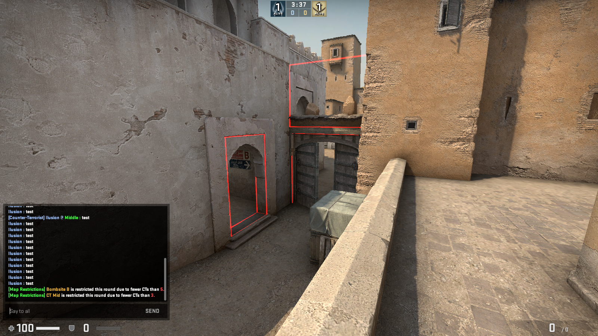

# Description
Restrict zones if there are fewer CTs than their accepted limit.

# Alliedmods
https://forums.alliedmods.net/showthread.php?p=2767376

# Dependencies
- Sourcecolors (include file) - https://github.com/Ilusion9/sourcecolors-inc-sm
- Intmap (include file) - https://github.com/Ilusion9/intmap-inc-sm

# ConVars:
sm_maprestrictions_touch_alert 1 - Alert players when they touch a restricted zone?

# How to add a zone?
Use devzones (https://forums.alliedmods.net/showthread.php?t=224839) and copy the zone coordinates in maprestrictions config.

# Bugs:
Weapons can go through walls and cannot be picked through them, but the C4 is an exception.
